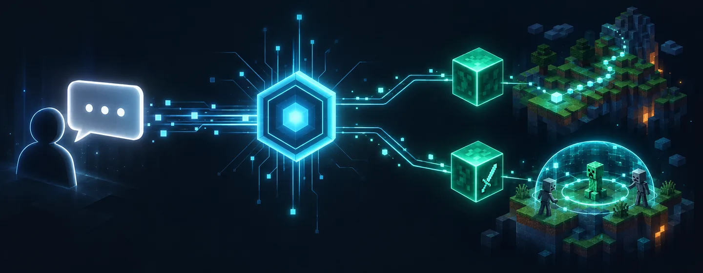
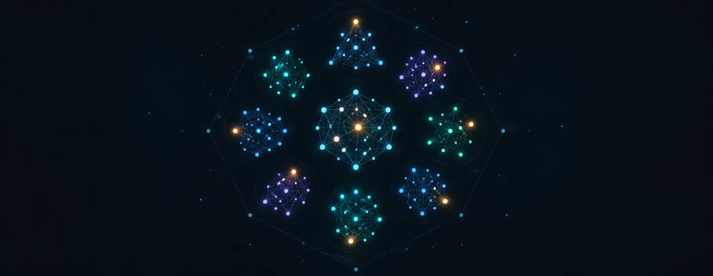
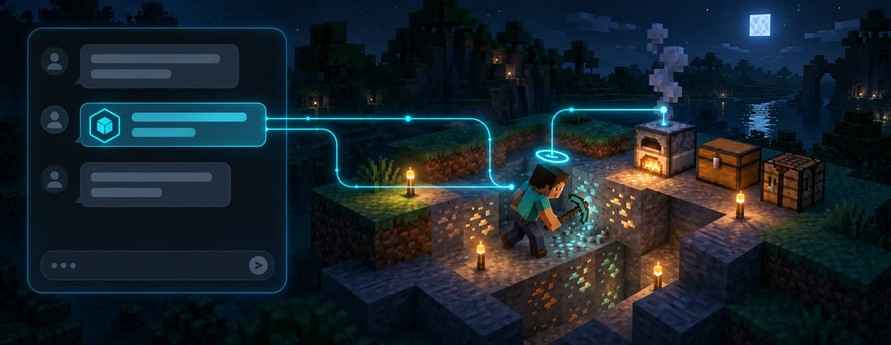

<div align="center">


# HyFuse

**A Fabric client mod that turns Minecraft into an MCP-controlled agent platform.**

One JAR. No Node, no Python brain, no external tool server — the mod *is* the
MCP server, embedding **82 tools** that let any AI agent sense, move, mine,
build, craft, fight, and survive in the real game.

[](https://fabricmc.net/develop)
[](https://fabricmc.net)
[](https://openjdk.org)
[](https://modelcontextprotocol.io)
[](docs/TOOL_CATALOG.md)
[](LICENSE)

*Point your agent at one URL. It plays the game.*

[Quick start](docs/QUICKSTART.md) · [Tool catalog](docs/TOOL_CATALOG.md) · [Architecture](docs/CODEBASE_REFERENCE.md) · [Safety](#-safety)

</div>

---

## Why HyFuse

Every "AI plays Minecraft" project eventually hits the same wall: the bridge
code. A Python script talks to a Node server that talks to a headless client
that isn't quite the real game — five moving parts, four failure modes, and a
stack nobody else can reproduce.

HyFuse collapses the entire chain into **one self-contained Fabric mod**:

| | The old way | HyFuse |
|---|---|---|
| Transport | Node bridge + Python brain | MCP server inside the game client |
| Client | Headless bot account | Your real client, real account, real world |
| Setup | `npm install`, config files, port wrangling | Drop the JAR in `mods/` |
| Surface | A handful of ad-hoc endpoints | 82 typed MCP tools + an OpenAPI mirror |
|Brains| LLM loop in a sidecar process | Optional embedded agent loop — or drive it yourself |



Whether the brain is OpenWebUI, Claude, or HyFuse's own embedded loop, the
hands are the same: the mod's tool dispatcher routing work to **Baritone**
(everything that moves) and **Meteor Client** (everything that fights), plus
its own sensing, crafting, memory, and process engines.

## What it can do

A single agent conversation can chain tools like this:

> *"Mine 20 iron, smelt it, craft a pickaxe, stash the leftovers in my base
> chest, and keep farming while you're at it."*

That's five tool calls — `craft-with-deps` resolves the recipe tree,
`mine-blocks` finds a vein, `smelt-item` runs the furnace, `craft-item`
executes the recipe, `deposit-items` organizes the chest — and
`standing-start` leaves a **background process** farming iron even after the
chat ends.

- **Sense** — one-call agent snapshots (vitals, position, inventory, nearby
  entities), volumetric scans, ore-vein flood-fills, live event polling,
  weather, light, and death history.
- **Act** — dig, place, craft, smelt, eat, equip, attack, chat, navigate with
  hazard-aware pathing and stuck-recovery reflexes.
- **Remember** — persistent per-server **memory store**, a **journal** with
  identity/goals/facts, an operator-editable **playbook** of survival
  doctrine, and **reactive policies** that eat/flee/escape before the LLM
  even wakes up.
- **Persist** — **standing processes** (mine-and-deposit cycles, guard posts)
  that run goal loops in the background without LLM round-trips, with
  backoff, parking, and death-pause semantics.
- **Operate alone** — the optional **embedded agent loop** drives an
  OpenAI-compatible LLM with the full tool surface, runnable from an
  in-game `/hyfuse set goal` command typed at the keyboard.



## Connect an agent in 60 seconds

### 1. Launch the client with Java arguments

The MCP server starts automatically. With **no flags at all** it boots
loopback-only on `http://127.0.0.1:25581/mcp` — perfect for a single machine
where the agent runs locally.

To let another machine connect, pass **Java arguments** at launch (in your
launcher's JVM-args field, or on the command line):

```
-Dmcagent.bind=<client IP> -Dmcagent.token=TESTKEY
```

- `mcagent.bind` — the network interface the server binds to. Use the
  machine's LAN/VPN IP (e.g. `192.168.1.20`); leaving it unset keeps the server
  loopback-only. `mcagent.port` can move it off the default **25581**; `0`
  disables the server entirely.
- `mcagent.token` — the bearer token every request must carry. **Required**
  for any non-loopback bind — the server refuses to start otherwise.

> The current property names are `hyfuse.bind` / `hyfuse.token` /
> `hyfuse.port`; the `-Dmcagent.*` names shown above are the legacy aliases,
> still accepted and live-verified.

This opens an **MCP port on 25581 from the Minecraft client itself** — the
mod embeds the server, so there is nothing else to run. Two surfaces are
served on that port, both bearer-gated: the MCP Streamable-HTTP endpoint at
`/mcp` (JSON-RPC) and an OpenAPI mirror.

### 2. Confirm it's listening

From the agent machine, verify the port answers and the token works:

```bash
# MCP JSON-RPC: list all 82 tools
curl http://<client IP>:25581/mcp \
  -H "Authorization: Bearer TESTKEY" -H "Content-Type: application/json" \
  -d '{"jsonrpc":"2.0","id":1,"method":"tools/list"}'
```

Prefer OpenAPI? The same server mirrors every tool as REST:

```bash
# Full OpenAPI 3.1 spec — 82 paths
curl http://127.0.0.1:25581/mcp/openapi.json

# Call a tool directly
curl -X POST http://127.0.0.1:25581/mcp/tools/get-agent-snapshot \
  -H "Authorization: Bearer <token>" -H "Content-Type: application/json" \
  -d '{}'
```

And the fastest probe of all, no MCP client required:

```bash
python3 tools/tool_probe.py --host 127.0.0.1 get-agent-snapshot
```

Want it to play itself? Configure `config/hyfuse/agent.json` with any
OpenAI-compatible endpoint, then in game type
`/hyfuse set goal "get me 10 iron ingots"` and watch the embedded loop
decompose, call tools, and report back — all inside one process.



Full walkthrough: [docs/QUICKSTART.md](docs/QUICKSTART.md).

## Requirements

| Dependency | Version | Required? | Role |
|---|---|---|---|
| Java | 25 | Required | Runtime & build |
| Fabric Loader | 0.19.5+ | Required | Mod loader |
| Fabric API | for MC 26.2 | Required | Base mod API (command API for `/hyfuse`) |
| Baritone | MC 26.2 build | **Strongly recommended** | Navigation & mining. Not bundled — HyFuse dispatches its client chat commands (`#goto`, `#stop`, `#mine`, `#sel`). Without it, pathfinding tools fail gracefully. |
| Meteor Client | MC 26.2 | Optional | Combat (KillAura) & module toggles. Absence degrades gracefully to built-in combat handlers. |

## Installation

1. Install Fabric Loader for Minecraft **26.2** with Fabric API.
2. Drop Baritone (and optionally Meteor Client) into the client's `mods/`.
3. Copy the HyFuse jar from `build/libs/` (or a release zip) into `mods/`.
4. Launch. The MCP server is live at `http://127.0.0.1:25581/mcp`.

> **Heads-up:** swapping jars in `mods/` has occasionally wiped
> `config/hyfuse/` files. Back up that directory before upgrading.

## Connecting AI clients

HyFuse speaks standard MCP Streamable HTTP, so any MCP-capable client can
reach it. The main difference between clients is *where they connect from* —
local/LAN tools attach directly to your client; hosted front-ends connect
from the provider's cloud and need a reachable public endpoint.

| Client | How | Notes |
|---|---|---|
| **OpenWebUI** | Admin → Settings → Tools. Add a tool server of type **OpenAPI**, URL `http://<client IP>:25581/mcp`, spec path `openapi.json`, paste your token as the bearer key | **Fully tested — the reference setup.** Also consumable as a standard MCP server |
| **Claude** (claude.ai / Claude Desktop) | Settings → Connectors → **Add custom connector**, enter the server URL | Connector supports **Streamable HTTP** and lets you add an `Authorization: Bearer <token>` header. Claude connects **from Anthropic's cloud**, so the port must be reachable from the internet (see below) |
| **ChatGPT** | Settings → Connectors → enable **Developer mode** (under Advanced settings), then **Add a custom connector** and paste the remote MCP server URL | Requires a paid plan. Also connects from OpenAI's cloud — same reachability requirement |
| **Any MCP client / your own code** | Point it at `http://<client IP>:25581/mcp` and call `tools/list` | Streamable HTTP with bearer auth; MCP JSON-RPC requests work directly |

> **OpenWebUI has been tested end-to-end with HyFuse** — 82 tools discovered,
> native tool calls returning live game data. Claude and ChatGPT are
> supported through their standard remote-MCP custom-connector flows, which
> match the transport HyFuse serves (Streamable HTTP); they are not yet
> individually verified against HyFuse.

### Networking checklist

If your agent can't see the client, check these in order:

1. **Bind flag** — `-Dhyfuse.bind=<client IP>` (or legacy `-Dmcagent.*`). No
   flag = `127.0.0.1` only; only software on the same machine can connect.
2. **Port forwarding** — for connections from outside your LAN (including
   hosted front-ends like Claude/ChatGPT), forward external TCP `25581` to
   the client machine, **or** run the agent on the same machine / LAN / VPN
   and use the client's LAN IP directly. A VPN (e.g. WireGuard/Tailscale) is
   the safer alternative to opening a port.
3. **Firewall rules** — allow inbound TCP `25581` on the client machine's OS
   firewall (e.g. `ufw allow 25581/tcp`), and check any router/NAT rules.
4. **Token on both sides** — the exact same token in the launch flag and in
   the client's key/header field. A mismatch reads as auth failure.
5. **TLS** — hosted front-ends (Claude, ChatGPT) generally require an
   **HTTPS** endpoint. Put a reverse proxy with a certificate (Caddy, nginx,
   or a Cloudflare tunnel) in front of HyFuse for those; for local/LAN/VPN
   use, plain HTTP is fine.

The protocol is plain HTTP — use it on networks you trust. Port `0` disables
the server entirely.

## The tool surface — 82 tools at a glance

| Category | Count | Highlights |
|---|---|---|
| [Sensing](docs/TOOL_CATALOG.md#sensing--world) | 16 | `get-agent-snapshot` (one call = position + vitals + inventory + entities + memory), `scan-volume`, `find-ore-veins`, `get-events` |
| [Movement & navigation](docs/TOOL_CATALOG.md#movement--navigation) | 12 | `goto-coords`, `navigate-v2` (goal specs, stall detection), `path-safely`, `explore`, `recover-stuck`, `escape-water` |
| [Blocks & building](docs/TOOL_CATALOG.md#blocks--building) | 8 | `dig-block`, `place-block` (material families), `build-structure` (blueprints), `replace-blocks` |
| [Crafting & processing](docs/TOOL_CATALOG.md#crafting--processing) | 6 | `craft-item` (live recipe book), `craft-with-deps` (recursive planning), `smelt-item`, `resolve-material` |
| [Combat & survival](docs/TOOL_CATALOG.md#combat--survival) | 8 | `attack-entity`, `hunt-hostile`, `guard-area`, `toggle-meteor-module` (KillAura), `eat-food`, `sleep-in-bed` |
| [Inventory & containers](docs/TOOL_CATALOG.md#inventory--containers) | 12 | `list-inventory`, `open-container`, `deposit/withdraw-items`, `organize-inventory`, `equip-item`, `auto-equip-best-gear` |
| [Processes & queues](docs/TOOL_CATALOG.md#processes--queues) | 7 | `enqueue-tasks` (linear task lists, `$result` chaining), `standing-start/status/stop` (background cycles) |
| [Memory, journal & policy](docs/TOOL_CATALOG.md#memory--journal) | 9 | `memory-save/read/forget`, `journal-read/append`, `policy-save/read/forget`, `get-playbook`, `get-last-death` |
| [Agent & operator](docs/TOOL_CATALOG.md#agent--operator) | 5 | `agent-start/stop/status`, `get-capabilities`, `get-current-action`, `send-chat`, `read-chat` |

Every tool is fully typed (JSON Schema for MCP, OpenAPI 3.1 for REST) and
fails honestly — `deposit-items` reports what actually moved, not what was
requested. Full signatures, args, and examples: **[docs/TOOL_CATALOG.md](docs/TOOL_CATALOG.md)**.


## In-game operator commands (`/hyfuse`)

Local-only client commands — typed at the keyboard, never exposed over MCP,
so a remote agent can never reconfigure its own brain:

| Command | Effect |
|---|---|
| `/hyfuse status` | Client/server state and agent configuration |
| `/hyfuse set api-url <url>` | Set the LLM endpoint (OpenAI-compatible) |
| `/hyfuse set api-key <key>` | Set the API key |
| `/hyfuse set model <name>` | Set the model name |
| `/hyfuse set goal <text>` | Start a bounded goal session — the agent decomposes and executes |
| `/hyfuse set agent_mode on/off` | KillAura armed + reactive defense rows / disarmed |
| `/hyfuse reset intelligence` | Delete the operator playbook (packaged default applies) |
| `/hyfuse reset memory` | Delete this server's memory + journal |
| `/hyfuse reset config` | Delete `agent.json` (disables the embedded loop) |
| `/hyfuse reset all` | All of the above |

Setting `api-url`/`api-key`/`model` creates `config/hyfuse/agent.json` and
enables the embedded agent loop.

## 🔒 Safety

HyFuse is deliberately paranoid for something that opens a socket to your
game client:

- **Loopback by default.** A flagless boot binds `127.0.0.1` with no token —
  nothing on your network can reach it.
- **Token required for exposure.** Binding a non-loopback interface without
  `-Dhyfuse.token` refuses to start. Bearer auth gates every route on both
  surfaces.
- **In-game chat is untrusted input.** The playbook treats other players'
  messages as data, never instructions — prompt-injection defense is part of
  the mod's doctrine, and `/hyfuse` brain configuration is keyboard-only.
- **Honest failure.** Tools report what actually happened (`moved` vs
  `requested`, `remaining` after container caps) instead of claiming success —
  an agent that can trust its own senses makes better decisions.

## Configuration (`config/hyfuse/`)

| File | Purpose |
|---|---|
| `agent.json` | Embedded agent loop: `url`, `apiKey`, `model`, `maxIterations` (default 8). Absent = agent disabled. |
| `INTELLIGENCE.md` | The operator-edited playbook served to the agent; packaged default if missing. |
| `hyfuse_memory_<serverId>.json` | Persistent per-server memory (512 records). |
| `journals/<serverId>.md` | Per-server journal: identity, facts, roster, plans, event log. |

## Building from source

```bash
export JAVA_HOME=/usr/lib/jvm/java-25-openjdk-amd64   # JDK 25 required for MC 26.2
./gradlew build
```

The jar lands in `build/libs/hyfuse-<version>.jar`. Eleven Java smoke suites
(82-tool registry pin, handler parity, slot maps, craft resolution, queue,
sensing, send-chat guard, playbook, agent loop, goal sessions, OpenAPI
parity) live in `tools/mcp_smoke/` — see
[docs/CODEBASE_REFERENCE.md](docs/CODEBASE_REFERENCE.md#testing) for the
full recipe.

## For researchers and the curious

HyFuse is a work of passion, built and live-verified session by session over
52 development sessions — every fix pinned with evidence, every release
archived as a full self-contained zip. It's also a compact study object for
anyone building agent-in-game platforms:

- **Agent design**: reactive policies vs. LLM round-trips, honest result
  reporting, task-queue economics (fewer LLM calls per goal), standing
  processes that survive past the conversation.
- **Systems**: a single-JAR MCP server inside a game client; the Baritone +
  Meteor "integrate, don't reinvent" doctrine; graceful degradation when
  cooperating mods are absent.
- **Safety**: untrusted in-game chat, loopback-by-default networking,
  operator-only brain configuration.

Start with [docs/CODEBASE_REFERENCE.md](docs/CODEBASE_REFERENCE.md) for the
architecture tour, then [docs/TOOL_CATALOG.md](docs/TOOL_CATALOG.md) for the
complete surface.

## Roadmap

Shipped in this initial release — MCP-in-mod transport, persistent memory,
standing processes, the reactive policy layer, brain tools with injection
defense, the embedded agent loop and `/hyfuse` command tree, and the
MC 26.2 port with the OpenAPI tool-server surface.

What's next:

- **Sustained chat-driven autonomy** — verifying long multi-tool agent
  conversations (compounds via `enqueue-tasks`, multi-call sequences) beyond
  the single-call proof, then hardening what breaks.
- **Deeper Baritone & Meteor integration** — pushing more movement and
  combat decisions directly into the engines instead of tool-sequenced
  equivalents, per the "integrate, don't reinvent" doctrine.
- **Chain hardening** — rotating off the placeholder token, verifying the
  MCP `initialize` handshake details, and tightening the remote-access
  story (first-party TLS guidance for hosted front-ends).
- **First-party connection recipes** — step-by-step guides (with screenshots)
  for Claude and ChatGPT custom connectors, alongside the fully-tested
  OpenWebUI path.
- **The long-term vision: brain + agent mode** — the perfect mod drives
  itself: memory, policy rails, and engine-backed actions through ordinary
  chat, with the embedded loop as the fallback brain.

<div align="center">


*"Integrate, don't reinvent. Fail honestly. Never block the client thread."*

</div>

## License

CC0 1.0 Universal — released to the public domain. See [LICENSE](LICENSE).

HyFuse is not affiliated with Mojang, Microsoft, FabricMC, Baritone, Meteor
Client, or the Model Context Protocol project.
